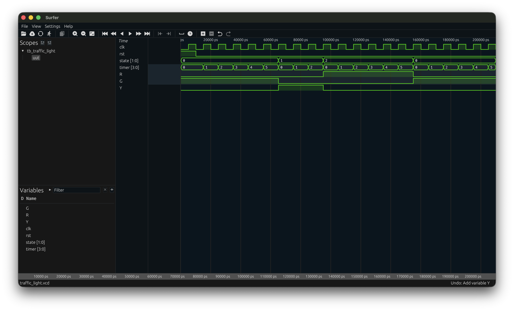

# FPGA Traffic Light Controller with Timer

## Overview
This project implements a digital Traffic Light Controller with a built-in countdown/count-up timer using an FPGA. The system cycles through standard traffic light states (Green, Yellow, Red) and outputs the current state's duration to a 7-segment display, providing real-time visual feedback. 

## Features
* **Finite State Machine (FSM):** Robust state handling for traffic light sequences.
* **Timed Transitions:** Precise timing for each light phase.
* **Hardware Interfacing:** Direct control of external LEDs and a 7-segment display via FPGA GPIO pins.
* **Simulation & Verification:** Fully tested logic using standard testbenches and waveform viewers.

## System States and Timing
Based on the waveform simulation, the FSM operates with the following states and timer values:

* **State 0 (Green Light):** The `G` output is HIGH. The timer runs for 6 clock cycles (counts 0 to 5).
* **State 1 (Yellow Light):** The `Y` output is HIGH. The timer runs for 3 clock cycles (counts 0 to 2).
* **State 2 (Red Light):** The `R` output is HIGH. The timer runs for 6 clock cycles (counts 0 to 5).

## Hardware Setup
The project is designed to be deployed on an FPGA board (such as the **Digilent Arty S7** shown in the circuit diagram) connected to a standard breadboard. 

### Components Required:
* 1x FPGA Development Board (e.g., Digilent Arty S7)
* 3x LEDs (Red, Yellow/Amber, Green)
* 1x 7-Segment Display (to show the `timer[3:0]` value)
* 330Ω Current Limiting Resistors (for LEDs and 7-segment segments)
* Breadboard and Jumper Wires

### Pin Connections:
* **LEDs:** The FPGA outputs `R`, `Y`, and `G` are wired to the respective LEDs through 330Ω resistors.
* **7-Segment Display:** The FPGA GPIO pins drive the A-G (and optionally DP) segments through 330Ω resistors to display the current numerical value of the timer. 
* **Ground:** All common grounds (LED cathodes and the 7-segment common pin, assuming Common Cathode) are tied to the FPGA's `GND`.

## Simulation
The core logic has been simulated to verify the timing and state transitions. 

*The waveform illustrates the `uut` (Unit Under Test) responding to the `clk` and `rst` signals. It verifies that the `timer[3:0]` successfully resets and counts up for each respective `state[1:0]`, triggering the correct `R`, `G`, and `Y` outputs.*

## How to Use
1. **Clone the Repository:** Download the project files to your local machine.
2. **Open in IDE:** Open the project in your preferred FPGA design suite (e.g., Xilinx Vivado, Intel Quartus).
3. **Run Simulation:** Run the provided testbench (`tb_traffic_light`) to observe the waveform and verify the logic.
4. **Synthesize and Implement:** Assign the constraints (pinout) matching your specific FPGA board and the provided connection diagram.
5. **Program Device:** Generate the bitstream and program your FPGA.

## Future Improvements
* Add pedestrian crossing logic and push-button interrupts.
* Implement a secondary set of traffic lights for an intersection.
* Add clock division to map the fast FPGA clock to real-time seconds.